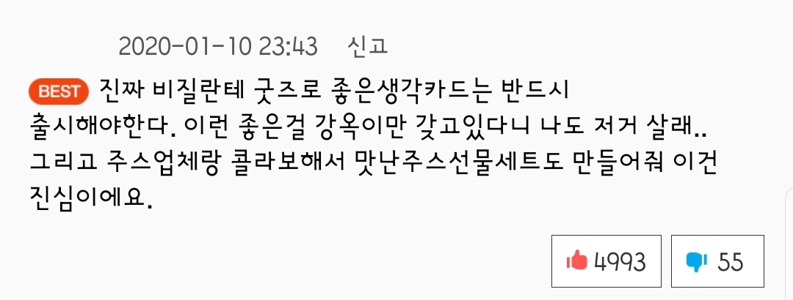
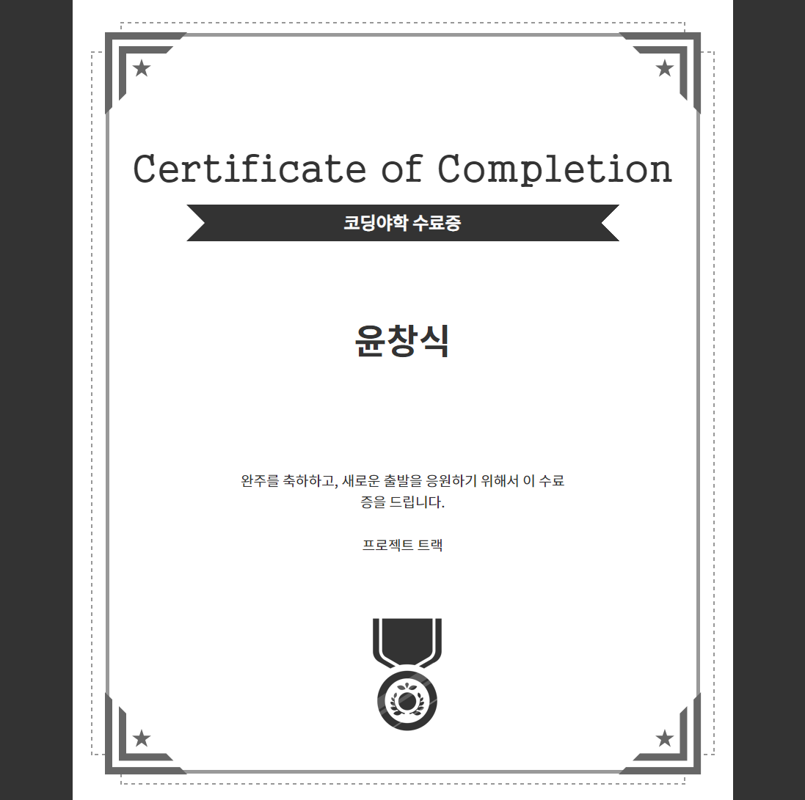

# 👍좋은 생각 카드🃏

## 💻데모

https://caesiumy.github.io/good-idea-cards/#/

> 백엔드도 배포 완료!!

## 🎈아이디어 동기

> 출처: https://comic.naver.com/webtoon/detail.nhn?titleId=703843&no=82
>
> 이렇게 좋은 생각 카드를 찾는 시간을 절약하기 위해 개발을 결심

 

> 여기 있습니다. 맛난 주스 선물 세트와의 콜라보는 무기한 보류입니다.

## 🧱개발 스택

- 프론트: `React.js`
- 백: `Django REST Framework`
- 스타일: `Ant Design` & `style-components`

## 📌기능

- [x] `Django REST Framework` 와 `React.js` 간의 연결
- [x] 서버에서 랜덤으로 카드 뽑아오기
- [x] 홈
- [x] 메뉴
- [x] 제안하기
- [x] 검색하기
- [x] 메뉴의 버튼을 눌렀을 때 토글 off
- [x] 버튼을 눌러 카드 새로 가져오기
- [x] 관리자 페이지 제작
- [x] PWA 장착
- [x] 구글 애널리틱스 장착

### 😥보류

- [ ] 코드 리팩토링 및 스플릿 -> 최적화 불필요 & 재사용 컴포넌트 없음
- [ ] 애니메이션 넣기!! -> 적합한 css & js 애니메이션 라이브러리 아직 발견 못 함...

## 📷스크린샷(모바일)

홈

메뉴

제안하기

검색하기

관리자 페이지

 
<a href="https://raw.githubusercontent.com/CaesiumY/good-idea-cards/master/screenshots/localhost_3000_(Galaxy%20S5)%20(4).png">PC버전</a>

## 📜코딩 야학 수료증

 
<a href="https://cert.yah.ac/?d=%ED%94%84%EB%A1%9C%EC%A0%9D%ED%8A%B8%20%ED%8A%B8%EB%9E%99&n=%EC%9C%A4%EC%B0%BD%EC%8B%9D&t=2&a=%EC%BD%94%EB%94%A9%EC%95%BC%ED%95%99">링크</a>

